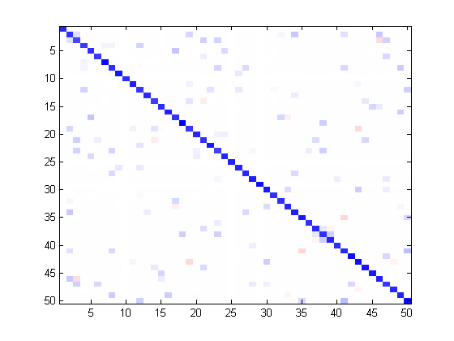

# Graphical-Lasso

Matlab implementation of the graphical Lasso model for estimating sparse inverse covariance matrix (a.k.a. precision matrix)

minimize_\Theta    tr( Theta * S ) - logdet( Theta )  + ρ * || Theta ||_1

over all positive-definite and symmetric matrices Theta. S is an estimate of the covariance matrix (usually sample covariance matrix) and ρ is a regularization parameter.

<strong>Input:</strong> sample covariance matrix S, penalty parameter ρ.

<strong>Output:</strong> the estimated precision matrix and the regularized covariance matrix.

<strong>Example:</strong>
We simulate an example with 50 variables and 200 observations.

|  | 
|:--:| 
| *True precision matrix* |

|  | 
|:--:| 
| *Graphical Lasso estimate* |

<strong>References:</strong>

[1] Fu (1998) Penalized regression: the bridge versus the lasso. J. Comput. Graph. Stats.

[2] Friedman, et al. (2007) Sparse inverse covariance estimation with the graphical Lasso. Biostatistics.
